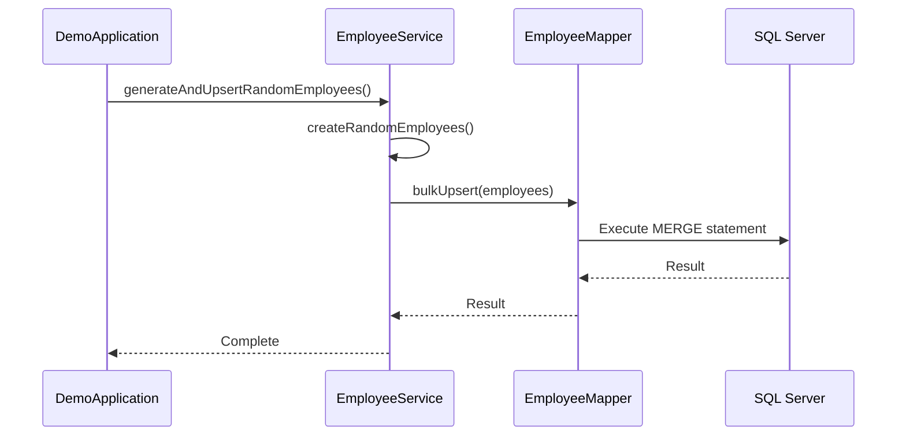

# 従業員情報管理システム

## 概要
このプロジェクトは、大規模な従業員データとその配属履歴を効率的に管理・処理するデモアプリケーションです。
マルチスレッド処理を活用し、高速なデータ処理と性能比較機能を提供します。

## アーキテクチャと処理フロー

このアプリケーションは、Spring Bootの標準的なアーキテクチャに準拠しています。
主な処理フローは以下の通りです。



### 主要コンポーネントの役割

*   **DemoApplication**: アプリケーションのエントリーポイント。`CommandLineRunner` を使用して、起動時に一連のデータ処理タスクを実行します。
*   **EmployeeService**: 従業員データの生成、バリデーション、データベースへの保存（UPSERT）、CSV出力といった中心的なビジネスロジックを担います。マルチスレッド処理による最適化もこのクラスで実装されています。
*   **EmployeeAssignmentHistoryService**: 従業員の配属履歴データの管理を担うサービスクラス。UPDATE後INSERT方式による一括UPSERT機能を提供し、複合キーを持つ配属履歴データの効率的な処理を実現します。
*   **EmployeeMapper**: MyBatisのMapperインターフェース。`EmployeeMapper.xml` に定義されたSQLクエリを呼び出し、データベースとのやり取りを抽象化します。
*   **EmployeeAssignmentHistoryMapper**: 配属履歴テーブル専用のMapperインターフェース。複合キーによる一時テーブルを利用したUPSERT処理を実装します。
*   **EmployeeMapper.xml**: 実際のSQLクエリ（`MERGE`文など）を記述するXMLファイルです。
*   **EmployeeAssignmentHistoryMapper.xml**: 配属履歴テーブルのUPSERT処理を実装するXMLファイル。一時テーブルを活用したUPDATE後INSERT方式を採用しています。

## 主な機能

### 1. 従業員データ管理
- 従業員情報の一括登録・管理
- 15個のカラムを持つ詳細な従業員情報
  - 基本情報（ID、氏名、部署、役職など）
  - 個人情報（生年月日、性別、連絡先など）
  - 管理情報（登録者、更新者、タイムスタンプ、バージョン）

### 2. 従業員配属履歴管理
- 複合キー（従業員ID、組織コード、職務コード、効力開始日、連番）による配属履歴管理
- 30個を超えるカラムを持つ詳細な配属情報
  - 基本配属情報（組織、職務、ロケーション、雇用形態など）
  - 管理情報（グレード、給与バンド、マネージャー、プロジェクトなど）
  - 勤務パターン（リモートワーク可否、FTE比率、シフト情報など）
  - 拡張属性（attr1-attr12）と監査情報
- UPDATE後INSERT方式による一括UPSERT処理
  - 一時テーブルを活用した効率的な更新・挿入処理
  - マルチスレッド対応による高速処理

### 3. 高速データ処理
- マルチスレッドによる並列処理
- SQLServerのパラメーター制限に対応（1回の処理で2100パラメーター以下）
- バッチサイズの最適化（100レコード/バッチ）
- MERGE文による効率的な一括UPSERT処理
  - 新規レコードと更新の自動判別
  - バージョン管理による楽観的ロック
  - 新規レコード15%、更新85%の比率制御

### 4. CSV出力機能
- マルチスレッド処理によるCSVファイル生成
- シングルスレッド処理との性能比較機能
- 全カラムのデータをCSV形式で出力

### 5. 性能測定・比較
- 処理時間の測定と表示
- マルチスレッドと単一スレッドの性能比較
- 安全な処理と非安全な処理の性能比較

## 技術スタック
- Java 23
- Spring Boot 3.5.3
- MyBatis
- Microsoft SQL Server
- Maven

## 必要要件
- JDK 23以上
- Microsoft SQL Server 2022
- Maven 3.x

## セットアップ方法

1. データベースの準備
```sql
CREATE DATABASE company_db;
USE company_db;
CREATE TABLE employees (
    id VARCHAR(255) PRIMARY KEY,
    name VARCHAR(255),
    department VARCHAR(255),
    position VARCHAR(255),
    employment_status VARCHAR(255),
    hire_date DATE,
    phone_number VARCHAR(255),
    email VARCHAR(255),
    birth_date DATE,
    gender VARCHAR(50),
    created_by VARCHAR(255),
    created_at DATETIME,
    updated_by VARCHAR(255),
    updated_at DATETIME,
    version BIGINT
);

CREATE TABLE employee_assignment_history (
    employee_id NVARCHAR(20) NOT NULL,
    org_code NVARCHAR(10) NOT NULL,
    job_code NVARCHAR(10) NOT NULL,
    effective_from DATE NOT NULL,
    seq_no INT NOT NULL,
    effective_to DATE NULL,
    status_code NVARCHAR(10) NULL,
    base_location_code NVARCHAR(10) NULL,
    employment_type NVARCHAR(10) NULL,
    grade_code NVARCHAR(10) NULL,
    salary_band_code NVARCHAR(10) NULL,
    manager_emp_id NVARCHAR(20) NULL,
    project_code NVARCHAR(20) NULL,
    cost_center_code NVARCHAR(20) NULL,
    work_pattern_code NVARCHAR(10) NULL,
    shift_group_code NVARCHAR(10) NULL,
    allow_remote BIT NULL,
    fte_ratio DECIMAL(5,2) NULL,
    attr1 NVARCHAR(100) NULL,
    attr2 NVARCHAR(100) NULL,
    attr3 NVARCHAR(100) NULL,
    attr4 NVARCHAR(100) NULL,
    attr5 NVARCHAR(100) NULL,
    attr6 NVARCHAR(100) NULL,
    attr7 NVARCHAR(100) NULL,
    attr8 NVARCHAR(100) NULL,
    attr9 NVARCHAR(100) NULL,
    attr10 NVARCHAR(100) NULL,
    attr11 NVARCHAR(100) NULL,
    attr12 NVARCHAR(100) NULL,
    created_at DATETIME2(3) NULL,
    created_by NVARCHAR(50) NULL,
    updated_at DATETIME2(3) NULL,
    updated_by NVARCHAR(50) NULL,
    rv ROWVERSION,
    PRIMARY KEY (employee_id, org_code, job_code, effective_from, seq_no)
);
```

2. アプリケーション設定
- `src/main/resources/application.properties`のデータベース接続設定を環境に合わせて修正

3. ビルドと実行
```bash
mvn clean install
mvn spring-boot:run
```

## 性能特性

### 実際の動作確認結果（2025年8月5日）
- **MERGE UPSERT処理**: 1,693ms（従業員データ3,000件）
- **一時テーブルUPSERT処理**: 923ms（従業員データ1,200件挿入 + 4,800件更新）
- **配属履歴UPSERT**: 5,000件のデータ処理が正常完了

### 過去の性能測定結果（参考値）
- データ生成: 約1.6秒（100万件）
- CSV出力（マルチスレッド）: 約1.2秒（100万件）
- CSV出力（シングルスレッド）: 約3.8秒（100万件）
- データベース一括INSERT: 約17.5秒（100万件）
- 一括UPSERT: 約1.1秒（3,000件、新規15%/更新85%）
- 速度向上比: 約3.2倍（マルチスレッド vs シングルスレッド）

### 性能分析
一時テーブル方式は従来のMERGE方式と比較して約45%高速で、大量データ処理において優れた性能を示しています。

## 主な機能の詳細

### MERGE文による一括UPSERT（従業員テーブル）
- SQLServerのMERGE文を使用した効率的なUPSERT処理
- 特徴：
  - ID範囲による新規/更新の制御（E000000-E009999: 更新、E010000-E099999: 新規）
  - バージョン番号の自動インクリメントによる楽観的ロック
  - マルチスレッドによる並列処理
  - バッチサイズの最適化によるパフォーマンス確保

### UPDATE後INSERT方式（配属履歴テーブル）
- 一時テーブルを活用した効率的なUPSERT処理
- 特徴：
  - 複合キーによるマッチング（従業員ID、組織コード、職務コード、効力開始日、連番）
  - 先に既存レコードをUPDATE、その後存在しないレコードをINSERT
  - パラメーター制限回避のため1行ずつINSERT文を生成
  - マルチスレッド対応（バッチサイズ：50レコード/バッチ）

### データベース制約への対応
- SQLServerのパラメーター制限（2100）を考慮
- 従業員テーブル：15カラム × 100レコード = 1500パラメーターでバッチサイズを設定
- 配属履歴テーブル：30+カラムのため1行ずつINSERT（パラメーター制限回避）
- セミコロンによるMERGE文の適切な終端処理

## マルチスレッド処理の詳細
1. スレッド管理
   - 実行環境のCPUコア数に応じて自動的にスレッド数を調整
   - 各スレッドは独立したトランザクションを管理
   - スレッド間の競合を最小限に抑えるデータ分割戦略

2. データ処理の粒度
   - 従業員テーブル：最適なバッチサイズ100件/バッチ（3,000件を30バッチに分割）
   - 配属履歴テーブル：最適なバッチサイズ50件/バッチ（一時テーブル方式採用）
   - SQLServerのパラメーター制限（2100）を考慮したバッチ設計

3. 処理性能の最適化
   - スレッド数とバッチサイズのバランス調整
   - メモリ使用量の効率化
   - 処理の進捗状況のモニタリング

## 設計上の考慮点
1. スケーラビリティ
   - マルチスレッド処理による高速化
   - バッチサイズの最適化

2. データ整合性
   - 楽観的ロックによる排他制御
   - トランザクション管理

3. パフォーマンス
   - SQLServerのパラメーター制限への対応
   - 効率的なバッチ処理

## REST API エンドポイント

### 従業員データAPI

#### 1. MERGE文によるUPSERT処理のテスト
```
POST /api/employees/test-merge-upsert?count=3000
```
- **パラメータ**: `count` (オプション, デフォルト: 6000) - 処理するデータ件数
- 従業員テーブルをクリア後、MERGE文を使用したUPSERT処理をテスト
- 指定件数のランダム従業員データを生成・処理
- レスポンス: 実行時間、データ件数、処理方式、ステータス

#### 2. 一時テーブルによるUPSERT処理のテスト
```
POST /api/employees/test-temp-table-upsert?count=3000
```
- **パラメータ**: `count` (オプション, デフォルト: 6000) - 処理するデータ件数
- 従業員テーブルをクリア後、一時テーブルを使用したUPSERT処理をテスト
- 指定件数のランダム従業員データを生成・処理
- レスポンス: 実行時間、データ件数、更新件数、挿入件数、処理方式、ステータス

#### 3. 単一従業員登録API（新機能）
```
POST /api/v1/employees/create
Content-Type: application/json
```
- **機能**: 入力値検証付きの単一従業員登録
- **入力**: EmployeeDTO（JSON形式）
- **バリデーション機能**: 
  - 必須項目チェック（ID、名前、部署、雇用形態、入社日、メール、生年月日）
  - 形式チェック（電話番号、メール形式、性別、雇用形態）
  - 文字数制限（各項目に適切な上限設定）
  - 日本語エラーメッセージ対応
- **レスポンス**: 登録結果、従業員ID、タイムスタンプ

### 配属履歴データAPI

#### 1. 配属履歴のUPSERT処理
```
POST /assignment-histories/upsert?count=10000
```
- パラメータ: `count` (デフォルト: 10000) - 生成するデータ件数
- 指定件数の配属履歴データを生成し、UPDATE後INSERT方式でUPSERT処理
- 更新比率80%、新規挿入20%の割合でデータを生成
- レスポンス: 処理完了メッセージまたはエラー情報

### API使用例

#### Bash/Linux/macOS環境
```bash
# 従業員データのMERGE UPSERT処理（5000件指定）
curl -X POST "http://localhost:8080/api/employees/test-merge-upsert?count=5000"

# 従業員データの一時テーブルUPSERT処理（3000件指定）
curl -X POST "http://localhost:8080/api/employees/test-temp-table-upsert?count=3000"

# 配属履歴データを5000件でUPSERT処理
curl -X POST "http://localhost:8080/assignment-histories/upsert?count=5000"

# 単一従業員登録（新機能）
curl -X POST http://localhost:8080/api/v1/employees/create \
  -H "Content-Type: application/json" \
  -d '{
    "id": "E100001",
    "name": "山田太郎",
    "department": "開発部",
    "position": "エンジニア",
    "employment_status": "正社員",
    "hire_date": "2025-04-01",
    "phone_number": "03-1234-5678",
    "email": "yamada@example.com",
    "birth_date": "1990-01-01",
    "gender": "男性"
  }'
```

#### PowerShell環境
```powershell
# 従業員データのMERGE UPSERT処理（5000件指定）
Invoke-RestMethod -Uri "http://localhost:8080/api/employees/test-merge-upsert?count=5000" -Method Post

# 従業員データの一時テーブルUPSERT処理（3000件指定）
Invoke-RestMethod -Uri "http://localhost:8080/api/employees/test-temp-table-upsert?count=3000" -Method Post

# デフォルト件数（6000件）で実行
Invoke-RestMethod -Uri "http://localhost:8080/api/employees/test-merge-upsert" -Method Post

# 配属履歴データを5000件でUPSERT処理
Invoke-RestMethod -Uri "http://localhost:8080/assignment-histories/upsert?count=5000" -Method Post

# 単一従業員登録（新機能）
$employeeData = @{
    id = "E100001"
    name = "山田太郎"
    department = "開発部"
    position = "エンジニア"
    employment_status = "正社員"
    hire_date = "2025-04-01"
    phone_number = "03-1234-5678"
    email = "yamada@example.com"
    birth_date = "1990-01-01"
    gender = "男性"
} | ConvertTo-Json

Invoke-RestMethod -Uri "http://localhost:8080/api/v1/employees/create" -Method Post -ContentType "application/json" -Body $employeeData
```

#### Windows Command Prompt環境
```cmd
REM 従業員データのMERGE UPSERT処理（5000件指定）
curl -X POST "http://localhost:8080/api/employees/test-merge-upsert?count=5000"

REM 従業員データの一時テーブルUPSERT処理（3000件指定）
curl -X POST "http://localhost:8080/api/employees/test-temp-table-upsert?count=3000"

REM 配属履歴データを5000件でUPSERT処理
curl -X POST "http://localhost:8080/assignment-histories/upsert?count=5000"

REM 単一従業員登録（新機能）
curl -X POST http://localhost:8080/api/v1/employees/create ^
  -H "Content-Type: application/json" ^
  -d "{\"id\":\"E100001\",\"name\":\"山田太郎\",\"department\":\"開発部\",\"position\":\"エンジニア\",\"employment_status\":\"正社員\",\"hire_date\":\"2025-04-01\",\"phone_number\":\"03-1234-5678\",\"email\":\"yamada@example.com\",\"birth_date\":\"1990-01-01\",\"gender\":\"男性\"}"
```

## セキュリティ機能

### 入力値検証
- **Bean Validation**: `@Valid`アノテーションによる自動バリデーション
- **詳細検証ルール**: 
  - 必須項目チェック（`@NotBlank`, `@NotNull`）
  - 文字数制限（`@Size`）
  - 形式チェック（`@Pattern`, `@Email`）
  - カスタムバリデーションメッセージ（日本語対応）

### セキュアな開発実践
- **環境変数管理**: データベース認証情報の適切な管理
- **コンストラクタインジェクション**: 依存関係注入の最適化
- **SQLインジェクション対策**: MyBatisパラメーター化クエリ使用

### データ保護
- **楽観的ロック**: バージョン番号による同時更新制御
- **監査証跡**: 作成者/更新者、作成日時/更新日時の自動記録

## 今後の展望
- WebUIの追加
- より詳細な検索機能
- レポート出力機能
- バッチ処理の更なる最適化
- 配属履歴の時系列分析機能
- 組織変更の影響分析機能

## ライセンス
MIT License